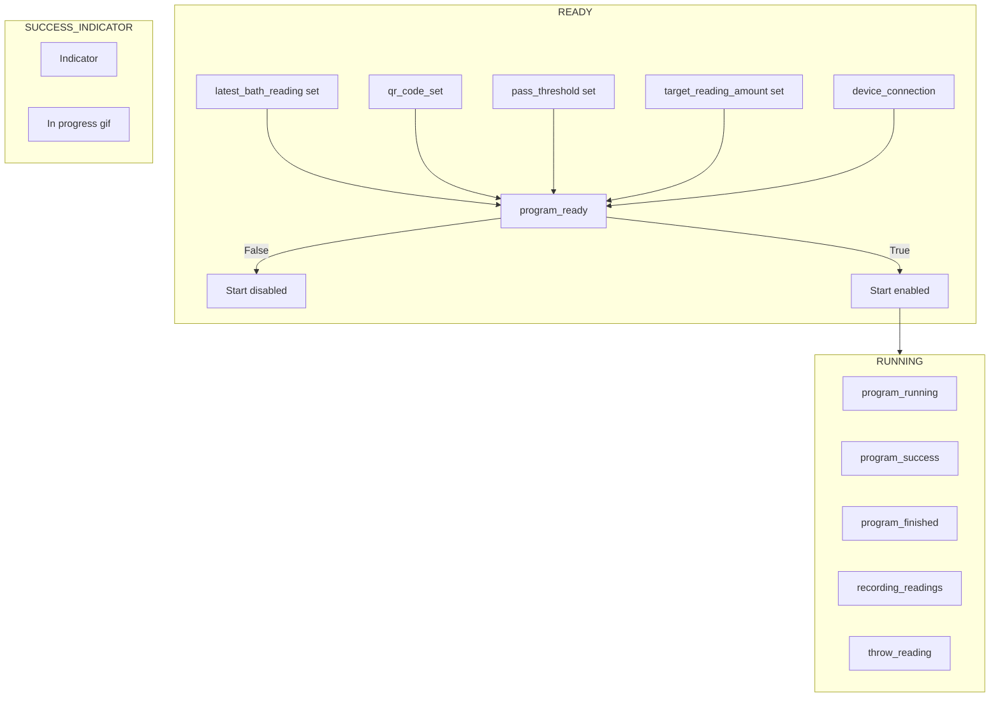

```mermaid
flowchart TB;
    subgraph READY
        direction TB
        program_ready;
        R1[latest_bath_reading set];
        R2[qr_code_set];
        R3[pass_threshold set];
        R4[target_reading_amount set];
        R5[device_connection]

        R1 & R2 & R3 & R4 & R5 --> program_ready;

        program_ready --> |False| Z
        program_ready --> |True| X

    end
    subgraph RUNNING
        direction RL
        P1[program_running]
        P2[program_success];
        P3[program_finished];
        recording_readings;
        throw_reading;
    end
    subgraph SUCCESS_INDICATOR
        direction LR
        I1[Indicator]
        I2[In progress gif]

    end
    X --> RUNNING
    Z[Start disabled]
    X[Start enabled]
```
